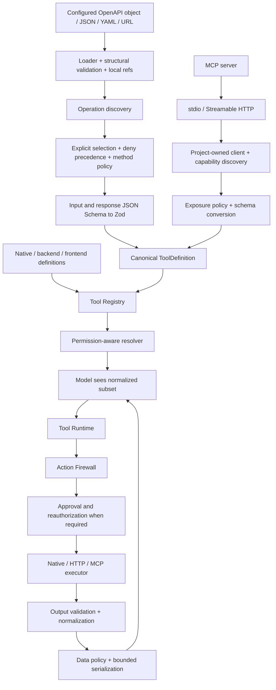

# Phase 8 architecture

OpenAPI and MCP adapters generate the existing `ToolDefinition`. The canonical registry, resolver, runtime, Action Firewall, approval store and audit sink remain shared with native and frontend tools.

## Package boundaries

- `openapi` -> `tools`, `protocol`, YAML and Zod. Node-only file/HTTP adapter.
- `mcp` -> `tools`, `protocol`, official MCP SDK and Zod. Node-only connections. Production SDK imports stay inside `client.ts`; test fixtures separately import the SDK server.
- `integrations` -> `protocol`. Plain process-local health/catalog records; the host explicitly updates them from concrete integration reports.
- `security` and `server` do not import either adapter. Server execution rejects external tools if no Action Firewall is configured. Source audit metadata is additive; no wire protocol change.

## OpenAPI pipeline

The loader accepts discriminated object/file/URL sources. URL loading is explicit, has a 30-second timeout and refuses redirects. The structural validator recognizes 3.0.x/3.1.x; this is a documented subset, not a complete OpenAPI conformance validator. Local `$ref` chains are resolved; external, cyclic and unsupported constrained-sibling references produce diagnostics.

Discovery merges path and operation parameters, preserves IDs/tags/descriptions and extracts JSON request/response schemas. Generation requires `include` or explicit `operations` entries. Exclusion and `expose: false` win. Once selected, GET is a read candidate, writes require risk-based approval, DELETE remains denied unless opted in. HTTP method classification is overridable; it is not proof that an endpoint is harmless.

Path/query parameters become top-level inputs; JSON bodies use `body`. Header inputs require an allowlist; credential and destination headers remain reserved. Input read-only fields are rejected, output write-only fields are removed. Unsupported constraints/serialization produce operation diagnostics. Declared JSON success responses are validated before transforms; absent response schemas retain the normalized response envelope.

The HTTP executor constructs URLs from trusted configuration and escaped values, rejects dot traversal and origin changes, refuses redirects, caps bodies at 1 MiB by default, and propagates cancellation/deadlines. Credentials resolve at execution time from trusted host context; credential headers override case-insensitive model-header conflicts. Known credential values are removed from echoed results. Raw upstream error bodies/messages are omitted. Host data policy then redacts domain-sensitive fields before browser/model exposure.

No retries occur by default. Configured retries are bounded; writes require an explicitly configured idempotency header. The API owner must actually honor that header. An aborted request is never reissued.

## MCP pipeline and lifecycle

`createMcpClient` wraps installed SDK 1.30.0, with finite configurable request/handshake deadlines. States are disconnected -> connecting -> connected, with error/closing/disconnected transitions. Concurrent connects share initialization. Failed initialization closes the transport. Tool discovery follows bounded cursors; descriptions are capped at 500 characters. Standard client disconnects notify subscribers and remove owned registrations immediately. Custom clients should implement `subscribeState`; otherwise hosts must refresh/dispose on disconnect.

Tools are named `mcp.<server>.<tool>`. Unknown remote tools default to denied; explicit include/overrides opt in conservatively. Descriptions, annotations, resources and prompts do not grant authority. Resources/prompts are explicit host APIs, capability-gated, untrusted data; no automatic system-prompt injection or indexing.

Refresh reconnects only when requested, with bounded configured attempts; it updates existing registrations and removes missing tools. Both integrations serialize refresh requests and reject refresh after disposal. In-flight operations are not rolled back by disposal; hosts cancel their run signals when shutting down.

## Audit and telemetry

Firewall decisions and server execution records share the Phase 7 sink. Allowlisted source identifiers, integration/operation, duration and numeric external success status supplement correlated run/tool IDs and approval outcomes. No request bodies or credential headers are copied into audit.

`onTelemetry` receives load/generate/register/connect/discover/execute timings. Observer exceptions cannot alter execution. Telemetry reports stage completion; generation/registration reports must still be inspected for partial failures. Existing runtime events cover execution success/failure and cancellation. This supplies a foundation for later diagnostics without implementing a DevTools platform.

See [API](Phase_8_API.md), [limits](Phase_8_Issues.md), and [ADR 0013](../../adr/0013-openapi-mcp-integration-architecture.md).
