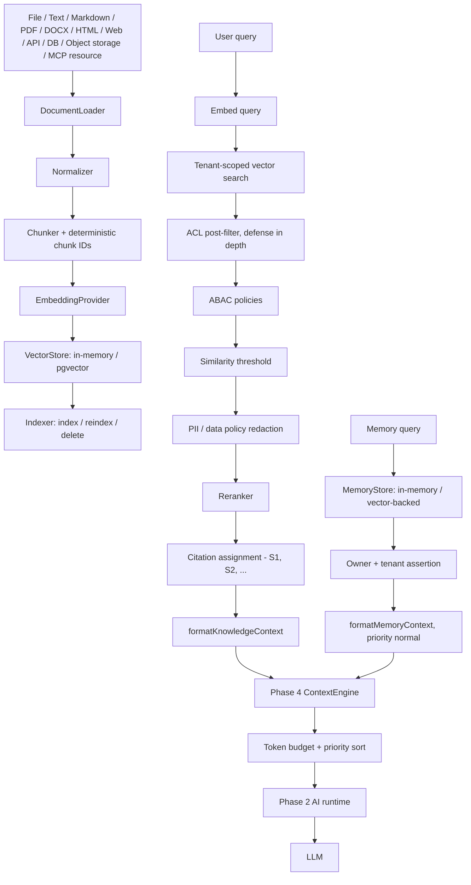
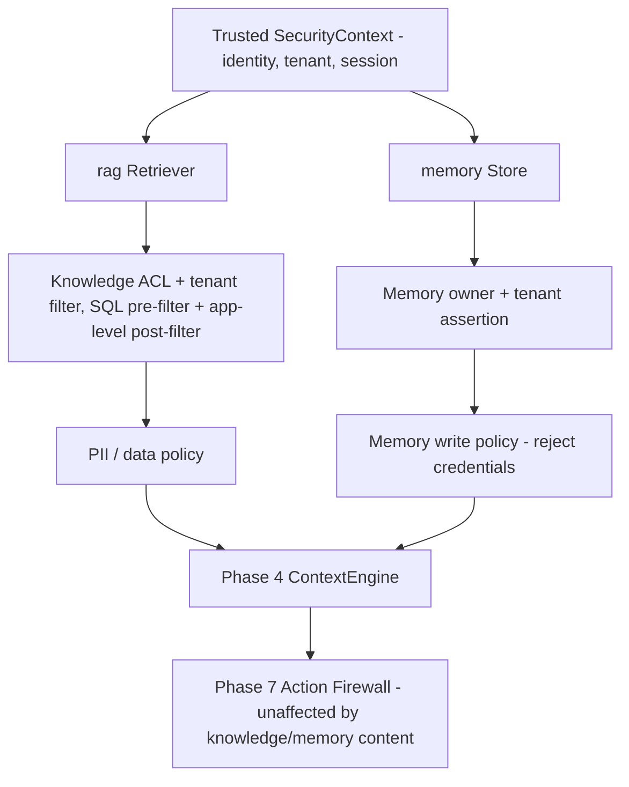

# Phase 9 architecture

Four new packages implement the knowledge/RAG/memory layer; none of them own context assembly,
authorization, or model invocation — those remain Phase 4's `@gixcopilot/context`, Phase 7's
`@gixcopilot/security`, and Phase 2's `@gixcopilot/provider` respectively.

## Package boundaries

Enforced by `eslint.config.js`'s dependency-constraint rules, not just documented:

- `@gixcopilot/knowledge` → protocol, mcp. Source/document/loader contracts and parsers only —
  no chunking, embedding, or vector-store concern. The MCP resource loader reuses Phase 8's MCP
  client; it does not open a second connection type.
- `@gixcopilot/rag` → protocol, security, knowledge. Chunking, embeddings, the `VectorStore`
  abstraction, permission-aware retrieval (reuses `SecurityContext`/`Policy`/`DataPolicy` rather
  than a second authorization model), reranking, citations, and the context-engine
  contribution mapper. Never a PostgreSQL/Drizzle dependency.
- `@gixcopilot/vectorstore-pgvector` → protocol, rag. The *only* package depending on
  `drizzle-orm`/`pg`, isolating that dependency from the core RAG abstractions (the database
  skill's rule). Implements `VectorStore` against two logically separate table sets
  (`knowledge_chunks`, `memory_embeddings`), selected by `table: 'knowledge' | 'memory'`.
- `@gixcopilot/memory` → protocol, security, rag. Reuses rag's `EmbeddingProvider`/`VectorStore`
  for semantic memory rather than inventing a second, incompatible vector system, and reuses
  `SecurityContext` for ownership/tenant checks rather than a second identity model.
- `@gixcopilot/react`/`@gixcopilot/ui` do **not** depend on knowledge/rag/memory. Citation and
  memory UI is duck-typed against plain data shapes the host application supplies — retrieval,
  ranking, and authorization already happened server-side by the time anything reaches the
  browser (Section 6's Retrieve → Authorize → Send to Model, applied to the UI boundary too).
- `scope:example` (only) may depend on all of the above — `examples/react-rag` is the one place
  every layer is wired together.

## Knowledge sources and loaders

`KnowledgeSource<TConfig>` is a small, typed envelope (`id`, `type`, `tenantId`, `acl`,
`config`) around a source-specific config; `createKnowledgeSourceRegistry()` is an optional,
non-singleton `register`/`get`/`list`/`remove` registry. `DocumentLoader.load()` is an
`AsyncIterable<KnowledgeDocument>` — large sources never have to load entirely into memory.
Loaders shipped: `text`, `markdown` (heading-aware), `pdf` (via `pdfjs-dist`, one document per
page with page/title provenance), `docx` (via `mammoth`, heading/paragraph/table-aware), `html`
(via `node-html-parser`, strips scripts/styles/nav noise), `web` (SSRF-guarded: `assertSafeWebUrl`
blocks loopback/link-local/private ranges and non-HTTP(S) schemes before every fetch, refuses
redirects, and bounds response size via a streaming byte-count check — Section 20's "no arbitrary
model-controlled fetch capability"), `api` (a developer-configured fetcher, not a model-controlled
one), `database` (a predefined, host-supplied safe query — no natural-language-to-SQL), an
`object-storage` client abstraction (no cloud SDK dependency; works against any `{ list, get }`
client), and `mcp-resource` (wraps Phase 8's `McpClient.listResources`/`readResource` — the same
client, not a second one).

`KnowledgeDocument`/`ChunkMetadata` carry `tenantId`/`acl`/`contentHash`/provenance
(`sourceId`, `documentId`, `title`, `uri`, `page`, `section`, `heading`, `position`) but never
arbitrary sensitive metadata. `deriveChunkId(documentId, position, content)` is a SHA-256 hash of
document identity + position + content, so reindexing unchanged content reproduces the same
chunk IDs (enables clean diffing) and changed content gets a new ID.

## Chunking, embeddings, indexing

`createRecursiveChunker` splits by a separator hierarchy (headings → paragraphs → sentences →
characters) with configurable size/overlap, preserving page/section/heading metadata rather than
cutting blindly every N characters. `EmbeddingProvider` (`provider`, `model`, `dimensions`,
`embedDocuments`, `embedQuery`) is satisfied by `createDeterministicEmbeddingProvider` (hash-based,
network-free, for tests) and `createOpenAIEmbeddingProvider` (real OpenAI, batches documents,
retries rate limits via `withRetry`, validates dimensions). `createIndexer` runs
Source → Loader → Parser → Chunker → Embed → `VectorStore.upsert`, replacing a source/document's
prior chunks atomically on reindex (`VectorStore.replace`, an advisory-locked delete+insert
transaction in the pgvector adapter) rather than accumulating stale duplicates, and reports
documents/chunks loaded/indexed/skipped/errors and duration.

## Vector storage

`VectorStore` (`upsert`/`search`/`delete`, optional `replace`/`list`) is the one storage-agnostic
contract both `createInMemoryVectorStore` (deterministic, for tests/small examples) and
`createPgVectorStore` (production, pgvector + HNSW cosine index) satisfy identically. Every
`VectorSearch` is tenant-scoped (`tenantId: string | undefined`, never accepted from model input)
and can carry a typed `VectorAccess` (subject/roles/permissions/groups) that the pgvector adapter
turns into a real SQL `WHERE` clause — ACL enforcement happens *before* `LIMIT`, not after, and a
malformed ACL shape fails closed rather than being treated as public. `VectorDeleteFilter`
requires an explicit tenant plus a source/document/chunk filter, so a delete can never silently
target every tenant. Embedding provider/model/dimensions travel with every record (Section 40);
the pgvector schema fixes one dimension count at migration time and `search`/`upsert` validate
against it rather than silently storing truncated vectors.

## Retrieval pipeline

`createRetriever({ vectorStore, embeddingProvider, reranker? })` runs: embed query → tenant-scoped
`VectorStore.search` (over-fetched relative to `topK` to leave headroom for post-filtering) →
per-candidate ACL check (`isAclSatisfied`, defense in depth on top of the SQL-level filter) →
ABAC (`evaluatePolicies` against caller-supplied `Policy[]`) → similarity threshold → data-policy
redaction (drops a candidate if redaction empties it) → rerank → citation assignment. Every
excluded candidate is recorded in `RetrievalDiagnostics.exclusions` with a reason
(`TENANT_MISMATCH` / `ACL_DENIED` / `PERMISSION_DENIED` / `BELOW_THRESHOLD` / `DATA_POLICY` /
`INVALID_CHUNK`) — unauthorized content is dropped the moment its check fails, never merely
hidden from the final answer while still having reached later stages. `createSimilarityReranker`
is the Section 68 baseline; `Reranker` is a one-method interface so a cross-encoder/LLM/provider
reranker can be substituted without touching retrieval.

## Citations

`assignCitationIds` stamps rank-ordered `[S1]`, `[S2]`, ... IDs onto already-authorized,
already-ranked items and produces the `Citation` (`id`, `sourceId`, `documentId`, `title?`,
`uri?`, `page?`, `section?`, `excerpt?`) each maps back to. `validateCitations(text, citations)`
detects `[S\d+]` references in model output and reports any that do not correspond to a real
retrieved chunk — a model cannot make an unknown ID valid just by writing it (Section 74; the
`react-rag` example's viewer/`[S999]` test exercises exactly this).

## Context Engine integration

`formatKnowledgeContext(RetrievalResult)` and `formatMemoryContext(MemorySearchResult[])` map
retrieval/memory output into plain, duck-typed `ContextContribution`s — structurally identical to
`@gixcopilot/context`'s `ContextItemInput` but with **no import dependency on it** (Section 77's
"no second prompt-construction engine," enforced the same way `rag`/`memory` avoid depending on
`context` at all). Knowledge contributions register at `'high'` priority; memory contributions are
fixed at `'normal'` — one tier below every `'critical'` system instruction, and the live user turn
is not a context item at all, so nothing produced by rag/memory can ever outrank the current
explicit instruction or trusted system prompt (Section 108/109 — see `Phase_9_Testing.md`'s
Arabic-instruction-wins evidence). The real `ContextEngine`'s existing token budget and stable
priority sort decide what survives truncation; rag/memory only decide *what* to register and at
*what priority*.

## Memory architecture

`MemoryRecord<T>` (`id`, `type`, `owner`, `tenantId?`, `value`, `createdAt`, `updatedAt`,
`expiresAt?`, `provenance?`, `derived?`, `metadata?`) is explicit about all five Section 88
concepts: conversation history is *not* duplicated here (it already exists from earlier phases);
`working`/`session`/`durable`/`semantic` are the four `MemoryType`s this package stores, each with
a bounded default TTL (`retention.ts`: 1h / 24h / 90d / 90d) that an explicit `expiresAt` always
overrides. `MemoryOwner` (`user` | `session` | `tenant` | `workspace` | `application`, plus an
`id`) is mandatory on every record — there is no ownerless, globally-shared memory.
`ownerFromSecurityContext(scope, securityContext)` derives an owner from the *trusted* Phase 7
context only, refusing (e.g.) a `'user'`-scoped memory when there is no authenticated identity,
never from model/query input.

`MemoryStore` (`put`/`get`/`search`/`delete`) is satisfied identically by
`createInMemoryMemoryStore` (deterministic, for tests/working/session memory) and
`createVectorBackedMemoryStore` (durable/semantic, persists through rag's `VectorStore` — commonly
`createPgVectorStore({ table: 'memory' })`, a logically separate `memory_embeddings` table, never
`knowledge_chunks`). Both call `assertMemoryAccess` on every read/write, which throws
`MEMORY_READ_DENIED`/`MEMORY_WRITE_DENIED` the moment an owner or tenant mismatch is found —
defense in depth on top of each store's own owner/tenant-scoped query. `createDefaultMemoryWritePolicy`
rejects any write whose value matches a credential-shaped pattern (private key blocks, API-key-
and bearer-token-shaped strings, `password:`/`api_key=`-style pairs) before it ever reaches
storage; `createMemoryService` layers an explicit persistence gate on top
(`'explicit-confirmation'` by default, or `'application-policy'`/`'never'`) plus an audit trail,
so "the model decided this looked useful" is never sufficient to persist something durably.

## Security model (unified with Phase 7)

Untrusted knowledge/memory content is always *data*, never instructions: it is injected as a
labeled `KNOWLEDGE CONTEXT`/memory context block, and it cannot call, approve, or bypass a tool —
the Action Firewall/RBAC/approval pipeline built in Phase 7 is not modified by, or aware of,
Phase 9 at all (see `Phase_9_Testing.md`'s prompt-injection regression). MCP-resource-backed
knowledge runs through the identical loader → chunk → embed → index → retrieve pipeline as every
other source type, so it inherits the same tenant/ACL enforcement with no separate code path
(Section 172; see the `react-rag` example's MCP resource test).

See [API](Phase_9_API.md), [limits](Phase_9_Issues.md), and
[ADR 0014](../../adr/0014-knowledge-rag-memory-architecture.md).
